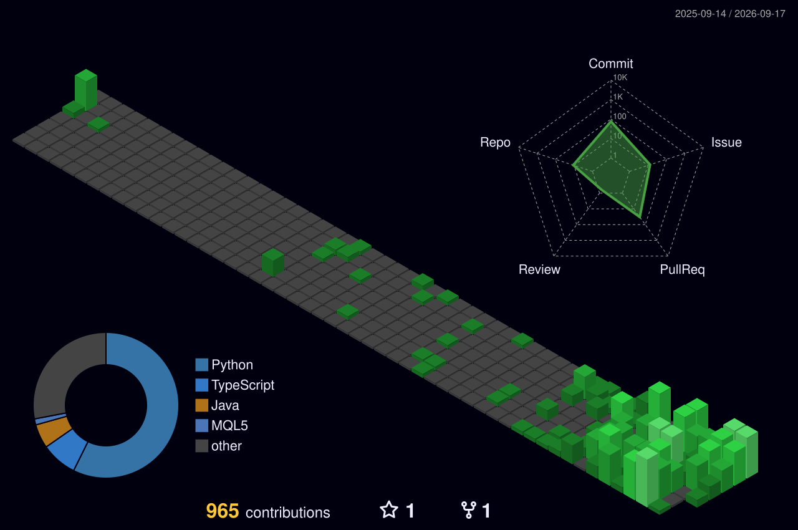

I build AI systems that check their own work — deterministic validators, provenance guards, typed tool registries — and the tooling that enforces those constraints across every project I ship.

B.Tech Computer Science, Manipal University Jaipur · 2025–2029

---

### Building

**Clyve** · *private* — A dual-portal financial OS for Indian CAs and SMEs. Documents come in as scans, go through OCR and classification, get extracted by a model, then hit a deterministic validation layer — arithmetic, GSTIN checksum, amount-in-words, date consistency — that decides post-or-review. LLMs never compute money: amounts are integer micro-units and the ledger is append-only, enforced at the database rather than in application code. Retrieval is vectorless, because similarity search couldn't be trusted to return the right figures when the figures are money.

**Voiceraft** · [voiceraft.org](https://voiceraft.org) — Multilingual AI voice agents for businesses. Inbound calls get answered, qualified, and booked into a live calendar mid-call, in English, French and Hindi/Hinglish, with every call landing in the client's CRM as structured data rather than a voicemail. Hinglish is built for real intra-sentential code-mixing — Hindi grammar carrying English words mid-clause — which breaks differently at generation, speech recognition and voice synthesis, so each layer is handled on its own.

**LegaDoc** · *SIH 26190, six-person team* — An evidentiary case-lifecycle platform for Indian law enforcement: 57 document types, chain of custody across ten roles, BNSS/BSA compliance. I wrote the system design the team builds against, and own the PII redaction worker — self-hosted NLP with recognisers tuned for Indian identifiers and for what OCR does to them, where a low-confidence match goes to a human rather than being silently redacted or silently missed.

### Shipped

| | | |
|---|---|---|
| [heri8age.in](https://heri8age.in) | D2C storefront | inventory reservation, GST and FY-scoped invoicing, fulfilment, admin portal |
| [heartartsindia.com](https://heartartsindia.com) | Client site | Next.js + Supabase, 94-key CMS with admin interfaces |
| [onca-waitlist](https://onca-waitlist-navy.vercel.app/) | Landing page | waitlist capture and early-access signup for ONCA |
| [mt5-mac-python-bridge](https://github.com/Ishaan-nasir/mt5-mac-python-bridge) | Tooling | runs MetaTrader 5 from Python on macOS without Wine, Docker or a VPS |
| [SnapCal](https://github.com/Ishaan-nasir/SnapCal) | Utility | timetable photo → editable grid → calendar export |

### Tooling

Five Claude Code skills that encode engineering discipline as something the model has to follow rather than something I have to remember — reasoning procedure, C4 system design, project handover, security auditing. Each gates work behind a named artifact: a phase without its artifact didn't happen.

They get pointed at my own production repositories, not sample projects. The security audit found four HIGH-severity issues in Clyve, including a prompt-injection path, each closed with a reproduction.

- [`reasoning-core`](https://github.com/Ishaan-nasir/reasoning-core) — gated phases, source discipline that forbids recall for versioned APIs, and a detector for its own failure mode: artifacts produced as decoration around a conclusion already committed to
- [`handover`](https://github.com/Ishaan-nasir/handover) — compresses a working session into a resumable state document, so a long solo build survives context resets instead of restarting from explanation

### Elsewhere

Smart India Hackathon 2026 — top 95 of 700+ teams · Dev Relay — third place, Team Redact · Google Developer Groups on Campus, MUJ — Technical Team

```
languages    TypeScript · Python · SQL
agents       MCP tool design · retrieval architecture · eval harnesses · prompt isolation
platform     Postgres · row-level security · job queues · Supabase · React/Next.js
local        quantized and MoE models · KV-cache quantization · speculative decoding
practice     threat modelling · C4 system design · security auditing
```



[contact.ishaannasir@gmail.com](mailto:contact.ishaannasir@gmail.com) · [LinkedIn](https://www.linkedin.com/in/ishaan-nasir/)
